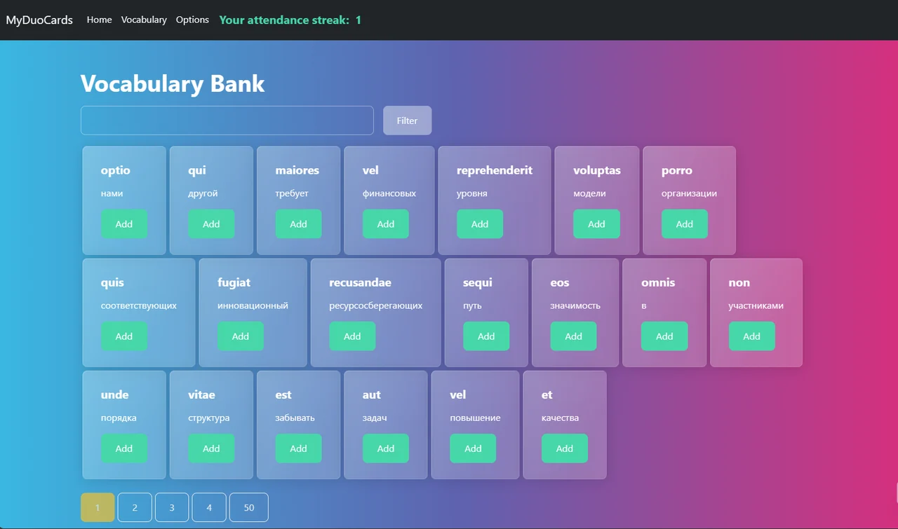
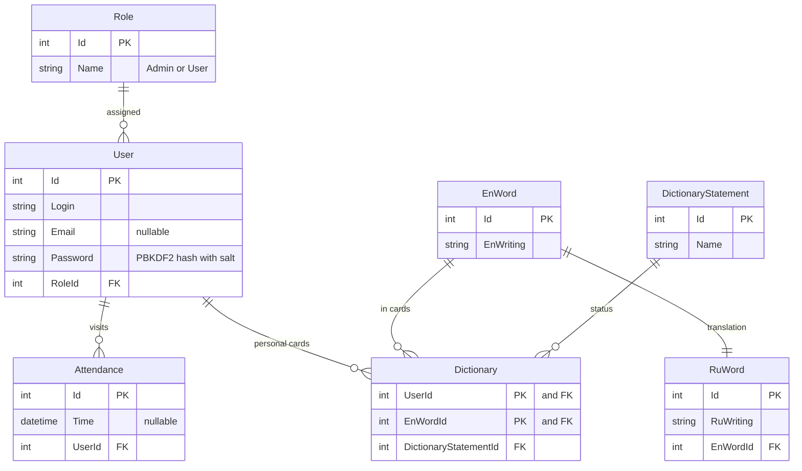
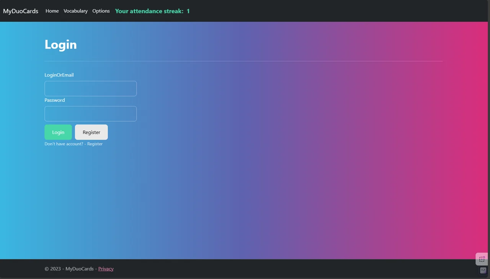
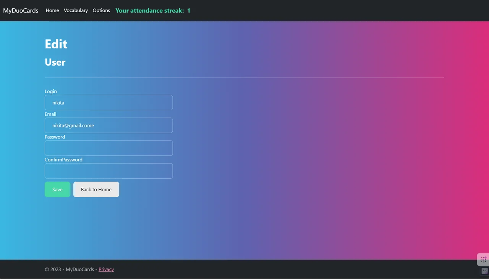
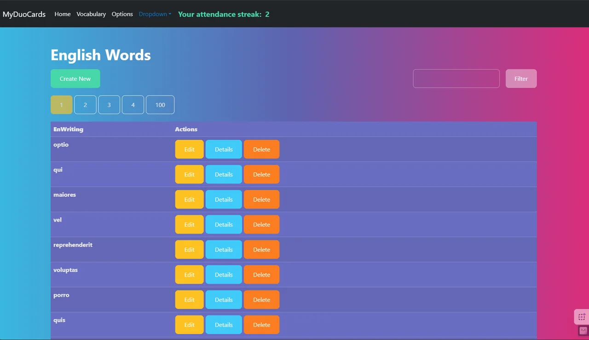

# MyDuoCards

A web application for learning English words using flashcards: a shared vocabulary bank from which users build personal dictionaries, search with automatic language detection, and a role-based admin panel with CRUD operations on all database entities.

A third-year course project (VKI NSU, 2023) built with ASP.NET Core MVC + EF Core + SQLite.

[](https://github.com/nupolovykh/MyDuoCards-coursework-aspnet-mvc/actions/workflows/build-and-smoke-test.yml)




## Tech Stack

| Layer | Technology |
| --- | --- |
| Backend | ASP.NET Core 8 MVC, cookie-based authentication |
| Data access | EF Core 8, SQLite provider, schema via `Database.EnsureCreated()` |
| Frontend | Razor views, Bootstrap 5.1, jQuery 3.6 + unobtrusive validation |
| Test data | Bogus — 999 English-Russian word pairs generated on first run |
| CI | GitHub Actions: build + functional smoke test |

## Quick Start

Only [.NET SDK 8.0](https://dotnet.microsoft.com/download/dotnet/8.0) is required —
the database will be created automatically.

```bash
git clone https://github.com/nupolovykh/MyDuoCards-coursework-aspnet-mvc.git
cd MyDuoCards-coursework-aspnet-mvc
dotnet run --project MyDuoCards
```

The application will open at the address printed by `dotnet run` and immediately
redirect to the login page. On first run, EF Core creates the file
`MyDuoCards/Database/fiction.db` and populates it with seed data; the path is read from
`ConnectionStrings:Default` in `appsettings.json` and can be overridden via the
`ConnectionStrings__Default` environment variable without code changes.

To access the admin panel, log in with the seeded admin account —
`Minako` / `beam` (set in `ApplicationContext.OnModelCreating`). To reset state,
delete the `fiction.db` file: it will be recreated on the next run.

## Features

- **Registration and login** — passwords are stored as salt + PBKDF2-HMAC-SHA256,
  100,000 iterations; comparison is constant-time.
- **Personal dictionary** (`/Home`) — cards added by the user with filtering and
  pagination (13 cards per page).
- **Shared vocabulary bank** (`/Vocabulary`) — all words in the application, 20 per page;
  the "Add" button adds a card to the user's personal dictionary.
- **Search with automatic language detection** — the query is checked for Cyrillic
  and searches either Russian translations or English spellings.
- **Visit counter** — app access is tracked no more than once per day, with the
  accumulated count displayed in the header.
- **Profile** (`/Options`) — change username, email, and password; validates that
  username and email are not already taken.
- **Admin panel** (`Admin` area) — full CRUD on six entities: users, roles, dictionaries,
  card statuses, English and Russian words. Each group of pages is protected with
  `[Authorize(Roles = "Admin")]`; the admin menu item is only visible to administrators.

## Architecture

### Database Schema



`Dictionary` is a junction table mapping users to words, with a composite key
(`UserId`, `EnWordId`); it represents a single "card in the personal dictionary",
and `DictionaryStatement` applies a status to it.

### Controllers

| Controller | Responsibility |
| --- | --- |
| `AccountController` | Registration, login, logout; issues cookies with claims for login and role |
| `HomeController` | Personal dictionary: fetching, filtering, pagination; tracking visits |
| `VocabularyController` | Shared vocabulary bank; adding and removing cards from user's dictionary |
| `OptionsController` | Profile editing |
| `DataBaseControllers/*` (6 total) | Admin CRUD pages, `Admin` area, accessible only to `Admin` role |

Navigation is collected in `Views/Shared/_Layout.cshtml` and changes depending on
whether the user is authenticated and has the admin role.

## CI/CD

[`.github/workflows/build-and-smoke-test.yml`](.github/workflows/build-and-smoke-test.yml)
goes beyond just checking that the project compiles. After `publish`, the workflow
boots the application and runs a real end-to-end scenario: registration → login.

1. `GET /` should return 200 — verifying that DI, EF Core, and view rendering
   didn't crash at startup;
2. `POST /Account/Register` with a fresh login → 302 redirect to login page;
3. `POST /Account/Login` with the same credentials → 302 redirect to `/Home` and
   authentication cookie set — meaning the password hashed at registration is
   correctly verified at login;
4. The `Database/fiction.db` file exists on disk.

Any deviation fails the job and dumps the application log. Triggers: push and
pull requests to `main`, plus manual dispatch.

## Screenshots

| Login | Profile | Admin |
| --- | --- | --- |
|  |  |  |

## Status and What Should Have Been Done Differently

The project was submitted in December 2023 and has not been actively developed since.
Below is an honest assessment of what needs improvement; some issues have already been
fixed.

**Fixed after submission:**

- Passwords were stored as unsalted SHA-256 — migrated to PBKDF2 with salt and
  constant-time comparison.
- The database path was hardcoded and pointed to a directory with a portable
  SQLite browser on the author's machine — the app did not run anywhere else;
  now the path is read from configuration.
- Upgraded to .NET 8, dependencies updated.
- Added CI with smoke test.

**Remaining issues:**

- No unit tests — all verification relies on a single CI scenario.
- Schema is created via `EnsureCreated()`, no migrations; changing the model
  without deleting the database is not possible.
- Seed admin account with a known password is created on every deployment.
- `[ValidateAntiForgeryToken]` is not on all POST methods — login and registration
  forms are not protected against CSRF.
- Card list queries fetch the entire result set into memory, then filter and
  paginate — performance will degrade beyond the 999 seed words.
- All business logic lives in controllers; no service layer.
- The spaced repetition system from the original spec was never implemented:
  the card status entity exists, but interval calculations do not.

## Documentation

- [Course project report (PDF, 29 pages)](docs/PzDuoCards.pdf) — requirements,
  technology choices, database description, and user manual with screenshots
  of all pages. Opens directly in the GitHub browser.
- [Same report in the original .docx](docs/PzDuoCards.docx)
- [Original User Story Map](docs/user-story-map.md) — design-phase requirements
  and notes on what did not make it into the final implementation.
